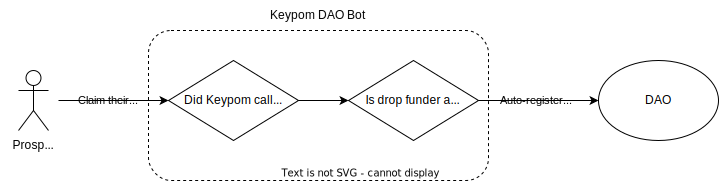

# DAO Bot Exploit Solution

Up to this point, the DAO bot has a **major** security exploit. In this section, you'll learn about the exploit, how to fix it and how you can prevent similar exploits when writing Keypom compatible contracts in the future.

---

## Breaking Down the Problem
To illustrate the exploit, a quick example can be analyzed: 

Min is a council member on MoonDAO. Since he has run onboarding campaigns through Keypom before, the DAO bot has its own role in MoonDAO.

Ben is a malicious user and is jealous because he was never allowed to join MoonDAO. He intends on adding himself to MoonDAO without Min's consent.

To do this, he creates an identical FunctionCall drop, exactly like the one Min used. This FunctionCall drop will invoke `new_auto_registration` on the DAO bot.

[Recall](daobot.md#adding-the-proposal) that the DAO bot currently checks 2 things before performing the auto-registration:
1. The function call is coming from Keypom.
2. There is enough attached deposit to cover the proposal bond.

Ben could create the an FC drop with the following method data, which would pass the first check. As part of the FC data, Ben would add an attached deposit of 0.1 $NEAR, which would pass the second check. 

At that point, when claimed, the checks would pass and the DAO bot would take the proposal object and pass it into the call to `add_proposal` on the MoonDAO contract.

Since the DAO bot has the special role, it would automatically approve the proposal and Ben would be added to MoonDAO.

In order to fix this, there needs to be a check in place to ensure that the FC drop originated from a trusted funder.

<details>
<summary>Ben's Malicious Drop</summary>
<p>

```js
{
    receiverId: DAO_BOT_CONTRACT,
    methodName: "new_auto_registration",
    args: JSON.stringify({
        dao_contract: MOON_DAO, // Points to MOON DAO
        proposal: {
            description: "Auto-Registering New Member",
            kind: {
                AddMemberToRole:{
                    member_id: BEN, // Ben is adding himself!
                    role: "new-onboardee-role"
                }
            }
        }
    }),
    attachedDeposit: parseNearAmount("0.1")
} 
```

</p>
</details>

:::warning
To summarize, since the DAO bot has the role to approve members *and* Keypom allows anyone to interact with the DAO bot through their own FC drops, a malicious drop could be created to add *anyone to any DAO*.

To fix this, the DAO bot needs to check that the FC drop is coming from a trusted funder.
:::

## Receiving the Drop Funder

Since the DAO bot will need to check if the funder is trusted, the function interface for `new_auto_registration` should be updated to include a new argument, `funder`.

```rs
new_auto_registration(dao_contract: AccountId, funder: AccountId, proposal: ProposalInput)
```

In order for this funder to be passed in, the FC drop will need to be modified. [Recall](drop.md#adding-proposal-and-injected-arguments) that Keypom can optionally inject important data into the outgoing arguments. This data can either be the:
- Drop ID
- Key ID
- Claiming account ID
- Drop funder ID

In this case, the drop's funder ID can be injected into the `new_auto_registration` `funder` argument if the `funderIdField` is set to `funder`. Therefore, the FC drop should be modified accordingly:

```js reference
https://github.com/keypom/keypom-docs-examples/blob/3d2ebdfdfe601bc7471a62e859682abaf9afb7cf/advanced-tutorials/dao-onboarding/createDaoDrop.js#L57-L81
```

This works great, but there is just one slight problem. Ben could hardcode the arguments to the method `new_auto_registration` and specify that the `funder` is Min, even though Ben created the drop.

## Validating Keypom Args

Validating what arguments came from Keypom, and what arguments were hardcoded by the funder is an extremely important topic to ensure the security of your smart contracts. Every time an FC drop is claimed, Keypom will *always* attach an extra parameter to the arguments of the function. This argument is `keypom_args` and is an object containing information about what was injected by Keypom. The `keypom_args` are created by Keypom and cannot be impersonated with any arguments. They are the canonical source of truth for what Keypom injected.

```js
KeypomArgs {
    account_id_field: String | undefined
    drop_id_field: String | undefined
    key_id_field: String | undefined
    funder_id_field: String | undefined
}
```

This object is sent along any method call that Keypom makes and can be used to perform the validation. If the DAO bot contract took in the keypom args, and did an assertion that the `funder_id_field` was set to `funder`, then the exploit would be fixed. There would be *no* way for Ben to impersonate Min as the funder of the drop in order to gain access to MoonDAO.

```rs
new_auto_registration(dao_contract: AccountId, funder: AccountId, proposal: ProposalInput, keypom_args: KeypomArgs) {
      require!(keypom_args.funder_id_field == Some("funder".to_string()), "BEN IS MALICIOUS! Funder is not Min!");
}
```

---


## Checking If the Funder is Trusted
At this point, the DAO bot knows the funder's account ID and has validated that they created the drop. The next step is to check if the funder holds a trusted role within the DAO.

While the definition of "trusted role" can change between DAOs, for this tutorial, this role will be `council`. 



:::note
If your DAO wishes to change the definition of a "trusted role", you are free to modify and deploy your own DAO bot contract as you see fit.
:::

### Approach

If the DAO bot was able to query for the policy information, then it could filter through the roles and find `council`. At this point, it could simply check if the funder is a member of `council` and then initiate the auto-registration flow

By looking at the [SputnikV2 contract](https://github.com/near-daos/sputnik-dao-contract/blob/main/sputnikdao2/src/policy.rs), you can see that each DAO's `Policy` has a `roles` vector.
```rust
pub struct Policy {
    /// List of roles and permissions for them in the current policy.
    pub roles: Vec<RolePermission>,
    ...
}
```

This vector contains each role their members.
```rust
pub struct RolePermission {
    /// Name of the role to display to the user.
    pub name: String,
    /// Kind of the role: defines which users this permissions apply.
    pub kind: RoleKind,
    ...
}

pub enum RoleKind {
    /// Matches everyone, who is not matched by other roles.
    Everyone,
    /// Member greater or equal than given balance. Can use `1` as non-zero balance.
    Member(U128),
    /// Set of accounts.
    Group(HashSet<AccountId>),
}
```

A sample DAO policy can be seen below:

<details>
<summary>Sample DAO policy</summary>
<p>

``` bash
View call: moondao.sputnikv2.testnet.get_policy()
{
  roles: [
    { name: 'all', kind: 'Everyone', permissions: [], vote_policy: {} },
    {
      name: 'council',
      kind: { Group: [ 'minqi.testnet' ] },
      permissions: [
        'add_member_to_role:VoteRemove',
        'upgrade_self:VoteRemove',
        'policy:VoteReject',
        'bounty_done:AddProposal',
        'policy:VoteRemove',
        'set_vote_token:VoteReject',
        'upgrade_remote:AddProposal',
        'remove_member_from_role:VoteApprove',
        'add_bounty:VoteRemove',
        'vote:VoteApprove',
        '*:Finalize',
        'bounty_done:VoteApprove',
        'transfer:VoteRemove',
        'add_bounty:VoteReject',
        'add_member_to_role:VoteReject',
        'set_vote_token:VoteRemove',
        'transfer:VoteApprove',
        'transfer:VoteReject',
        'config:VoteReject',
        'call:VoteReject',
        'remove_member_from_role:VoteReject',
        'policy:AddProposal',
        'bounty_done:VoteRemove',
        'set_vote_token:AddProposal',
        'upgrade_self:AddProposal',
        'set_vote_token:VoteApprove',
        'config:VoteApprove',
        'policy:VoteApprove',
        'add_bounty:VoteApprove',
        'remove_member_from_role:VoteRemove',
        'transfer:AddProposal',
        'upgrade_remote:VoteReject',
        'call:VoteApprove',
        'add_member_to_role:AddProposal',
        'call:AddProposal',
        'call:VoteRemove',
        'config:AddProposal',
        'remove_member_from_role:AddProposal',
        'upgrade_remote:VoteApprove',
        'upgrade_remote:VoteRemove',
        'upgrade_self:VoteApprove',
        'upgrade_self:VoteReject',
        'vote:VoteReject',
        'vote:VoteRemove',
        'vote:AddProposal',
        'add_member_to_role:VoteApprove',
        'config:VoteRemove',
        'add_bounty:AddProposal',
        'bounty_done:VoteReject'
      ],
      vote_policy: {
        add_member_to_role: { weight_kind: 'RoleWeight', quorum: '0', threshold: [ 1, 2 ] },
        policy: { weight_kind: 'RoleWeight', quorum: '0', threshold: [ 1, 2 ] },
        vote: { weight_kind: 'RoleWeight', quorum: '0', threshold: [ 1, 2 ] },
        set_vote_token: { weight_kind: 'RoleWeight', quorum: '0', threshold: [ 1, 2 ] },
        remove_member_from_role: { weight_kind: 'RoleWeight', quorum: '0', threshold: [ 1, 2 ] },
        transfer: { weight_kind: 'RoleWeight', quorum: '0', threshold: [ 1, 2 ] },
        add_bounty: { weight_kind: 'RoleWeight', quorum: '0', threshold: [ 1, 2 ] },
        upgrade_self: { weight_kind: 'RoleWeight', quorum: '0', threshold: [ 1, 2 ] },
        bounty_done: { weight_kind: 'RoleWeight', quorum: '0', threshold: [ 1, 2 ] },
        call: { weight_kind: 'RoleWeight', quorum: '0', threshold: [ 1, 2 ] },
        config: { weight_kind: 'RoleWeight', quorum: '0', threshold: [ 1, 2 ] },
        upgrade_remote: { weight_kind: 'RoleWeight', quorum: '0', threshold: [ 1, 2 ] }
      }
    },
    {
      name: 'Keypom DAO Bot',
      kind: { Group: [ 'keypom-dao-bot.testnet' ] },
      permissions: [
        'add_member_to_role:VoteApprove',
        'add_member_to_role:VoteRemove',
        'add_member_to_role:VoteReject',
        'add_member_to_role:AddProposal'
      ],
      vote_policy: {
        transfer: { weight_kind: 'RoleWeight', quorum: '0', threshold: [ 1, 1 ] },
        upgrade_self: { weight_kind: 'RoleWeight', quorum: '0', threshold: [ 1, 1 ] },
        remove_member_from_role: { weight_kind: 'RoleWeight', quorum: '0', threshold: [ 1, 1 ] },
        set_vote_token: { weight_kind: 'RoleWeight', quorum: '0', threshold: [ 1, 1 ] },
        bounty_done: { weight_kind: 'RoleWeight', quorum: '0', threshold: [ 1, 1 ] },
        policy: { weight_kind: 'RoleWeight', quorum: '0', threshold: [ 1, 1 ] },
        add_member_to_role: { weight_kind: 'RoleWeight', quorum: '0', threshold: [ 1, 1 ] },
        call: { weight_kind: 'RoleWeight', quorum: '0', threshold: [ 1, 1 ] },
        config: { weight_kind: 'RoleWeight', quorum: '0', threshold: [ 1, 1 ] },
        upgrade_remote: { weight_kind: 'RoleWeight', quorum: '0', threshold: [ 1, 1 ] },
        vote: { weight_kind: 'RoleWeight', quorum: '0', threshold: [ 1, 1 ] },
        add_bounty: { weight_kind: 'RoleWeight', quorum: '0', threshold: [ 1, 1 ] }
      }
    }
  ],
  default_vote_policy: { weight_kind: 'RoleWeight', quorum: '0', threshold: [ 1, 2 ] },
  proposal_bond: '100000000000000000000000',
  proposal_period: '604800000000000',
  bounty_bond: '100000000000000000000000',
  bounty_forgiveness_period: '604800000000000'
}
```

</p>
</details>

### Verifying Funder and Getting DAO Policy

The first step is to call `get_policy` on the DAO contract. After `get_policy` is called, a callback function is invoked to receive and parse the policy.

``` rust reference
https://github.com/keypom/dao-bot/blob/2c3a7bac8b18e1134483f0736e2ca9e2152f8509/src/lib.rs#L103-L119
```

### Ensuring Funder is Council
After the policy is received, the council role is found using a filter. The role's hashset is then searched to see if the funder exists in that set. If yes, then the auto-registration continues and `add_proposal` is called. 

```rust reference
https://github.com/keypom/dao-bot/blob/2c3a7bac8b18e1134483f0736e2ca9e2152f8509/src/lib.rs#L122-L164
```

---

## Human Gating the DAO Bot (Mainnet Only)
With the introduction of the [SoulBound Token Standard](https://github.com/robert-zaremba/NEPs/blob/robert/nep-sbt/neps/nep-0393.md), a proof-of-humanity protocol was implemented on NEAR, known as [I-Am-Human](https://i-am-human.app/). With this came the ability to human-gate certain actions, such as self-nominating or participating in governance.

As DAOs are critical in governance and community, the need to human-gate these automatic DAO registrations became a high priority. By leveraging the I-Am-Human Registry's [`is_human`](https://github.com/near-ndc/i-am-human#additional-queries) human checker, you can open up the option for you DAO auto-registrations to be human-gated using the following code to parse the `is_human` response. 

``` rust reference
https://github.com/keypom/dao-bot/blob/a19a2d29b42514a1e9d5f11c993b79f207c4a00f/src/lib.rs#L158-L180
```

:::info
This check will only be performed **if specified in the drop**! By default, human-gating is turned **off**. 

Below is an example of a drop that is human-gated. Notice the `human_only` parameter!
:::

``` js reference
https://github.com/keypom/keypom-docs-examples/blob/290cbce2c939573dbc8cb2b03598c2b2af5f91c2/advanced-tutorials/dao-onboarding/createDaoDrop-mainnet.js#L48-L84
```


---

## Full Code
The code for this can be seen below: 

```rust reference
https://github.com/keypom/dao-bot/blob/2c3a7bac8b18e1134483f0736e2ca9e2152f8509/src/lib.rs#L103-L164
```

:::info
The full code for the completed DAO bot can be found [here](https://github.com/keypom/dao-bot/blob/main/src/lib.rs).
:::

---


## Conclusion

In this tutorial, you learned how people can use [malicious drops](#breaking-down-the-problem) to exploit your DAO. You then saw how you can protect yourself, by checking the incoming call's drop funder and their roles in your DAO. This started with [receiving the drop funder](#receiving-the-drop-funder) by using `keypom_args`, then [verifying injected arguments](#checking-the-drop-funder) and finally parsing the DAO policy and [checking the funder's roles](#ensuring-funder-is-council) in the DAO. 

All of this work ensures that only approved members (such as Council) can use Keypom FC drops to create auto-registration campaigns for your DAO. This helps ensure the integrity of your DAO as you bring on more new members. 

This concept and approach can be used any time where important assets or processes are gated only by arguments such as a DAO contract or NFT series ID. It is important to ensure that the incoming drop is coming from a trusted source and that the arguments are validated as having been injected by Keypom. This will protect you from malicious actors creating identical Keypom drops to exploit your products. 

In the next section, you'll be reviewing all of your work so far by testing the whole auto-registration system.